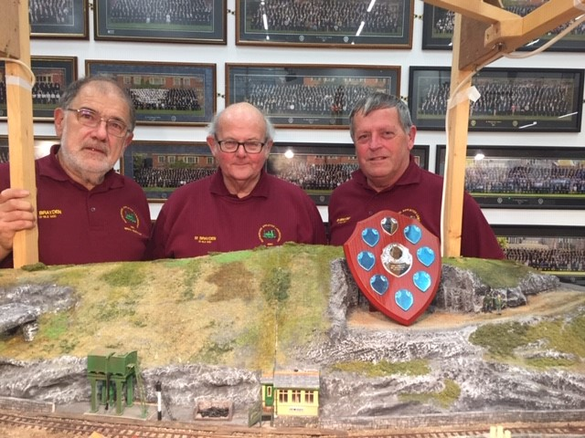

## Exhibitions
#### The Didcot Model Railway Exhibition 2019

The Model Railway Club will be exhibiting their Australian themed Narrow gauge layout (Sams Creek) at the following venue (hosted by the Abingdon Model Railway Club).

**Saturday 19th October 2019 (10:00-16:30)**

**Didcot Civic Hall, Britwell Road, Didcot, Oxfordshire OX11 7JN**