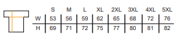
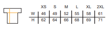

##Size guide
The size guide shows measurements in garment size in cm. The horizontal measurement is the width, not the full circumference. Approximate equivalent UK sizes are shown below below - this is for quite a baggy fit. The best way to ensure the correct size is to measure a similar garment you already own that you like the fit of and compare it to the charts.

Mens:

S (36-38), M (38-40), L (40-42), XL (42-44), 2XL (44-46)

Ladies:

XS (8), S (10), M(12), L (14), XL (16), XXL (18)

Because these are bespoke items they're non-refundable (unless due to manufacturing defects). However, if your hoodie doesn't fit, do contact us and we'll try to help you exchange or sell your hoodie on within the club. We may also have a few in stock that you can try for size - contact us to enquire.